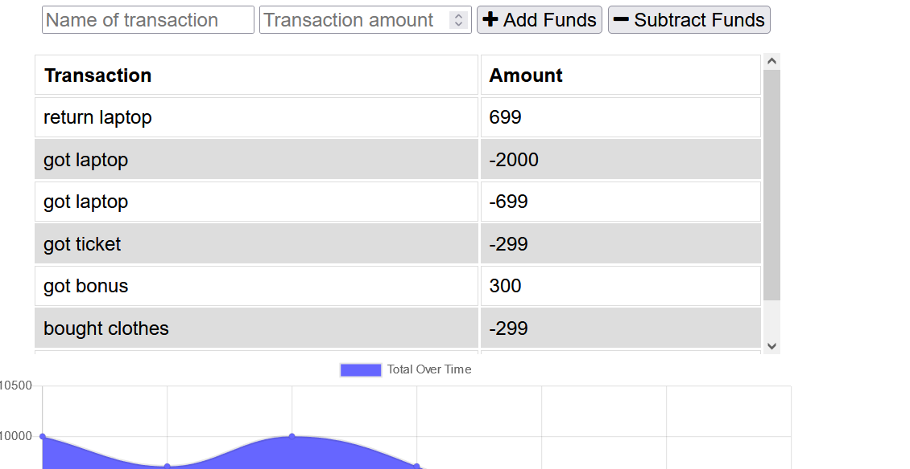

# Budget-Tracker

## Summary  

Updated an existing budget tracker application to allow for offline access and functionality. If the user enters transactions offline, the total should be updated when they're brought back online. This is deployed to Heroku

## Installation

install Node. After install node type the following
npm init
npm install
npm start

## Website
https://pacific-basin-72829.herokuapp.com/

## Tools used

Node, Express, NoSQL, mongoose, Service-worker, compression, morgan and IndexedDB.

## Contributors

Zohaib Ali
